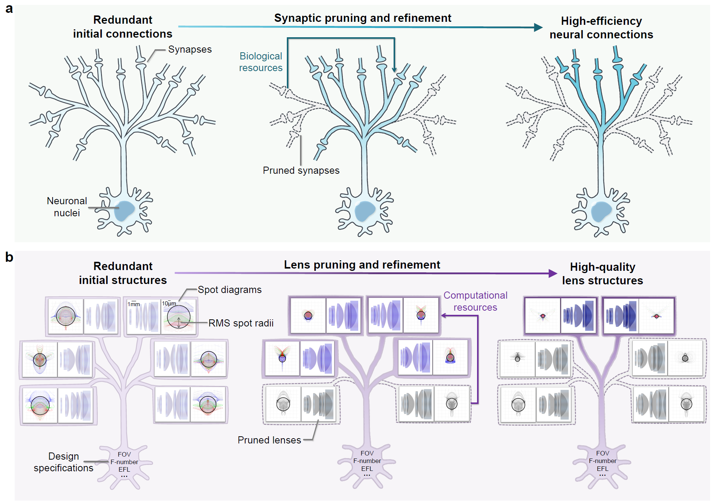

# **Neuro-Inspired Automated Lens Design**

## **Overview**

This paper presents OptiNeuro, a novel framework for automated lens design inspired by synaptic pruning in mammalian neural development. Lens design is a highly non-convex optimization problem that traditionally requires extensive human expertise, leading to inefficiencies and limited diversity in designs. OptiNeuro addresses this by automating the entire process, from initial structure generation to final optimization, achieving quasi-human-level performance in complex aspheric lens design tasks.

## **Inspiration from Neurobiology**

The core idea of OptiNeuro is drawn from the synaptic pruning mechanism in developing mammalian brains. During neural development, redundant connections are formed initially and then refined through pruning, while biological resources are reallocated to strengthen relevant pathways. 

This biological paradigm is translated into lens design as follows: OptiNeuro first generates an overcomplete set of candidate lens structures, then progressively prunes low-performance designs while dynamically reallocating computational resources to refine the remaining candidates.

## **Methodology**

OptiNeuro formulates lens design as an optimization problem minimizing a Merit Function (MF), which combines image quality metrics (e.g., RMS spot radius) and physical constraints (e.g., focal length, distortion). The framework involves:

• Automated Initialization: Physics-constrained random generation of diverse initial structures.

• Iterative Pruning and Refinement: In each step, low-quality lenses are pruned, and resources are reallocated to expand the variable space of survivors.

• Incremental Optimization: Variables are added progressively (e.g., starting with basic curvatures and introducing higher-order aspheric coefficients later).

• Random Perturbation: To escape local minima, constrained perturbations are applied to lens parameters without degrading optical performance.

## **Key Innovations**

1. Neuro-Inspired Algorithm: Mimics neural pruning to balance global search and computational efficiency.
2. GPU-Accelerated Parallelization: Leverages multi-GPU architectures for rapid exploration of design spaces.
3. Adaptive Optimization: Uses an improved Adam algorithm with automated learning rate initialization and perturbation strategies.
4. Handling Complex Specifications: Capable of designing aspheric, spherical, and hybrid lenses with unprecedented specs (e.g., ultra-wide-angle fisheye lenses).

## **Experimental Results**

1. Six-Element Aspheric Lens Design

OptiNeuro was benchmarked against a state-of-the-art curriculum learning method. It reduced the average RMS spot radius from 12.506μm (baseline) to 2.506–3.032μm while maintaining distortion below 6% (vs. 12.79% baseline). The design time was shortened from over 10 days to under 4 days.

2. Nine-Element Aspheric Lens Design

In four challenging tasks (A1–A4), OptiNeuro achieved average RMS spot radii comparable to human-designed references (e.g., A1: 1.973–2.158μm vs. 2.135μm for manual design), demonstrating quasi-human-level capability.

3. Glass-Plastic Hybrid Fisheye Lens Design

For a novel specification (200° FOV, F/2.1, TTL=21.5mm), OptiNeuro explored six design forms (DFs) in parallel. DF1 (GGPGSPPPP) was identified as optimal, with an RMS spot radius of 2.862μm and MTF curves meeting requirements across spatial frequencies.

## **Discussion and Implications**

• Efficiency: OptiNeuro reduces design cycles from months to days by leveraging parallel GPU resources.

• Limitations: While it automates design, human experts are still needed for downstream tasks like tolerance analysis and cost estimation.

• Future Potential: The framework can be adapted to freeform, reflective, and off-axis lenses. It also facilitates the creation of large-scale lens databases for data-driven optics.

## **Code and Data Availability**

• Source Code: Implemented in PyTorch, available at the GitHub repository upon manuscript acceptance.

• Data: Simulated images, lens files, and material libraries are provided on the GitHub repository.

## **Conclusion**

OptiNeuro represents a significant advancement in automated lens design, bridging biological inspiration with computational optimization. It enables high-quality, diverse lens designs with minimal human intervention, paving the way for transformative applications in optics and imaging.

This introduction summarizes the paper "Neuro-inspired automated lens design" by Yao Gao et al. For full details, refer to the manuscript and supplementary materials.
